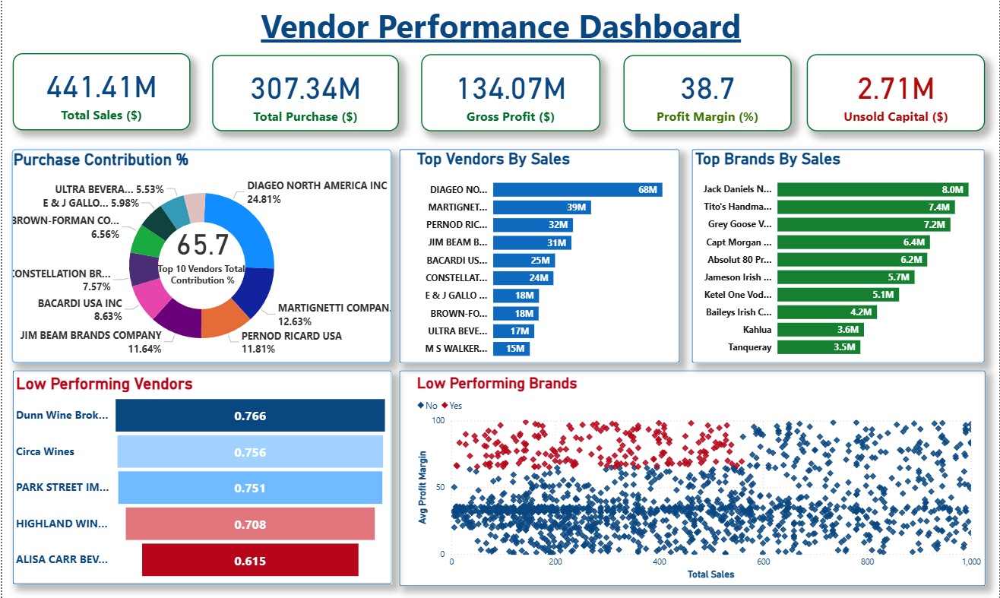

<h1 align="center">Vendor Performance Analysis</h1>

End-to-End Data Analytics Project using Python, SQLite, SQL, Power BI, and Data Visualization

This project analyzes vendor performance, purchasing behavior, inventory efficiency, profitability, and procurement trends to generate actionable business insights and support data-driven decision making.

# Project Overview

This project demonstrates a complete data analytics workflow starting from raw data ingestion to interactive business intelligence dashboard development.

The project includes:

- Loading multiple CSV datasets into Python
- Building a SQLite database
- Data cleaning and preprocessing
- Performing Exploratory Data Analysis (EDA)
- Creating business metrics using SQL
- Building an interactive Power BI dashboard
- Generating business recommendations and insights

The objective of this project is to transform raw sales, purchase, inventory, and vendor data into meaningful business intelligence for procurement optimization and vendor performance evaluation.

# Dataset Information

### Datasets Used

| Dataset | Description |
|----------|------------|
| purchases.csv | Purchase transaction records |
| sales.csv | Sales transaction records |
| purchase_prices.csv | Product purchase price details |
| vendor_invoice.csv | Freight and vendor invoice information |
| begin_inventory.csv | Beginning inventory records |
| end_inventory.csv | Ending inventory records |

### Dataset Description

The datasets contain information related to:

- Vendor details
- Product information
- Purchase transactions
- Sales transactions
- Inventory levels
- Freight costs
- Product pricing
- Revenue generation
- Procurement activities

# Tools & Technologies

<table align="center">
<tr>
<th>Tool / Technology</th>
<th>Purpose</th>
</tr>

<tr>
<td><b>Python</b></td>
<td>Data loading, cleaning, and automation</td>
</tr>

<tr>
<td><b>Pandas</b></td>
<td>Data manipulation and preprocessing</td>
</tr>

<tr>
<td><b>NumPy</b></td>
<td>Numerical computation</td>
</tr>

<tr>
<td><b>SQLite</b></td>
<td>Database creation and management</td>
</tr>

<tr>
<td><b>SQL</b></td>
<td>Data querying and aggregation</td>
</tr>

<tr>
<td><b>Matplotlib</b></td>
<td>Data visualization</td>
</tr>

<tr>
<td><b>Seaborn</b></td>
<td>Statistical visualization</td>
</tr>

<tr>
<td><b>Power BI</b></td>
<td>Dashboard development</td>
</tr>

<tr>
<td><b>Jupyter Notebook</b></td>
<td>Analysis environment</td>
</tr>

<tr>
<td><b>GitHub</b></td>
<td>Project version control and documentation</td>
</tr>

</table>

# Project Workflow

## Data Ingestion

Raw CSV files were loaded into Python and ingested into a SQLite database.

### Tasks Performed

- Imported raw datasets
- Validated file structure
- Created SQLite database tables
- Automated data ingestion pipeline
- Logged ingestion activities

## Exploratory Data Analysis (EDA)

Performed detailed exploratory analysis to understand vendor behavior, sales trends, and profitability patterns.

### EDA Activities

<ul>
<li>Univariate Analysis</li>
<li>Bivariate Analysis</li>
<li>Distribution Analysis</li>
<li>Outlier Detection</li>
<li>Correlation Analysis</li>
<li>Vendor Performance Analysis</li>
<li>Inventory Analysis</li>
<li>Profitability Analysis</li>
</ul>

### Visualization Techniques Used

- Histograms
- Boxplots
- Scatter Plots
- Correlation Heatmaps
- Bar Charts
- Distribution Plots

## Data Cleaning & Preprocessing

Performed data preprocessing tasks such as:

- Handling missing values
- Data type conversion
- Removing inconsistencies
- Standardizing text columns
- Data validation
- Feature engineering

## SQL Analysis using SQLite

The cleaned datasets were imported into SQLite and analyzed using SQL queries.

### SQL Tasks Performed

- Created database tables
- Imported cleaned datasets
- Performed joins across multiple tables
- Generated vendor-level summaries
- Created analytical KPIs

### SQL Concepts Used

<ul>
<li>SELECT Statements</li>
<li>WHERE Clauses</li>
<li>GROUP BY</li>
<li>ORDER BY</li>
<li>Aggregate Functions</li>
<li>JOIN Operations</li>
<li>Common Table Expressions (CTEs)</li>
<li>Filtering & Sorting</li>
</ul>

# Feature Engineering

Several business metrics were created for performance evaluation.

| Metric | Formula |
|----------|----------|
| Gross Profit | Total Sales Dollars − Total Purchase Dollars |
| Profit Margin | Gross Profit ÷ Total Sales Dollars |
| Stock Turnover | Total Sales Quantity ÷ Total Purchase Quantity |
| Sales to Purchase Ratio | Total Sales Dollars ÷ Total Purchase Dollars |

These metrics help evaluate vendor efficiency, profitability, and inventory movement.

# Power BI Dashboard

An interactive Power BI dashboard was built to monitor vendor performance and business profitability.

## Dashboard Features

### Executive KPI Cards

- Total Sales
- Total Purchases
- Gross Profit
- Profit Margin
- Unsold Capital

### Vendor Analysis

- Top Vendors by Sales
- Purchase Contribution Analysis
- Low Performing Vendors

### Brand Analysis

- Top Brands by Sales
- Low Performing Brands

### Inventory Analysis

- Stock Turnover Tracking
- Unsold Inventory Monitoring

### Profitability Analysis

- Gross Profit Evaluation
- Profit Margin Analysis
- Sales-to-Purchase Performance

### Interactive Features

- Dynamic Filters
- Vendor Selection
- Brand Selection
- Drill-Down Analysis
- Cross Filtering

# Dashboard Preview

# Key Insights

### Vendor Dependency Risk

The top vendors contribute a significant portion of total purchases, creating supplier concentration risk.

### Bulk Purchasing Benefits

Higher purchase volumes result in lower procurement costs, demonstrating economies of scale.

### Inventory Optimization Opportunity

Unsold inventory represents locked capital that can be optimized through better inventory planning.

### Profitability Variations

Substantial differences exist between top-performing and low-performing vendors.

### Brand Growth Opportunities

Several high-margin brands have relatively low sales volume, creating opportunities for targeted promotions.

# Business Recommendations

### Vendor Diversification

Reduce dependence on a limited number of vendors to minimize supply chain risk.

### Inventory Optimization

Improve inventory turnover through better forecasting and procurement planning.

### Pricing Strategy Improvement

Review pricing strategies for underperforming products.

### Procurement Optimization

Continue leveraging bulk purchasing strategies to maximize margins.

### Marketing Enhancement

Increase visibility of profitable but low-volume products through targeted campaigns.

# Project Outcome

This project demonstrates practical skills in:

- Data Cleaning
- Exploratory Data Analysis (EDA)
- SQL Querying
- Database Management
- Data Visualization
- Business Intelligence
- Power BI Dashboard Development
- Data Storytelling
- Business Recommendation Generation

Data Analyst | SQL | Python | Power BI | Business Intelligence

LinkedIn: Add Your LinkedIn Profile

GitHub: Add Your GitHub Profile
